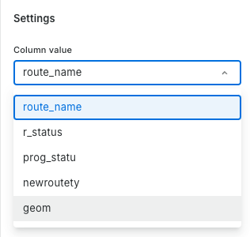
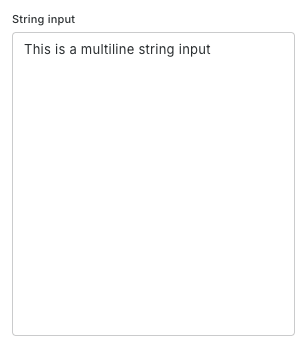
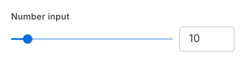
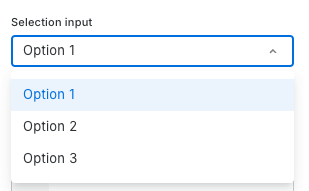
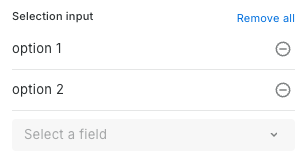
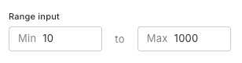
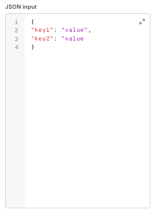
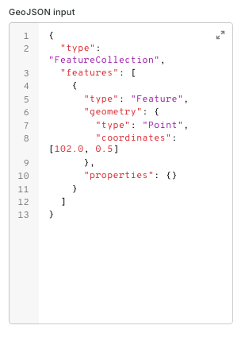
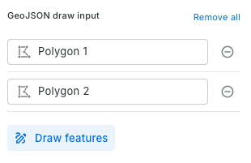
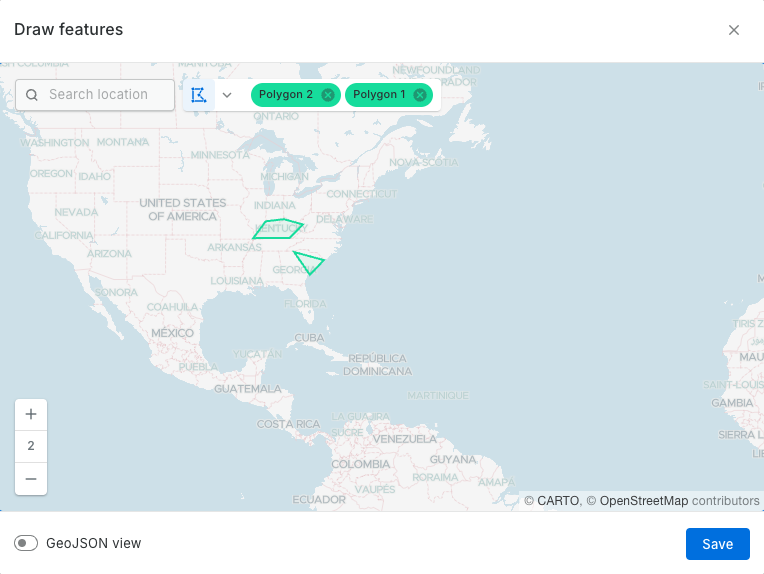

# Component metadata

Here you can find a reference of the different properties that must be contained in the metadata object of the component.

This is the expected structure of the metadata file:

```json
{
    "name": "component_name",
    "title": "Component title",
    "description": "Component description",
    "version": "1.0.0",
    "icon": "component_icon.svg",
    "externalReference": {
        "label": "External documentation",
        "href": "https://example.com"
    },
    "cartoEnvVars": [],
    "inputs": [
        {
            "name": "input_table",
            "title": "Input table",
            "description": "The table to add the column to",
            "type": "Table"
        }
    ],
    "outputs": [
        {
            "name": "output_table",
            "title": "Output table",
            "description": "The table with the column added",
            "type": "Table"
        }
    ]
}
```

Some important notes about the metadata structure:

* `name`: A unique identifier for the component that matches its folder name
* `title`: A human-readable title displayed in the UI
* `description`: A brief explanation of what the component does
* `version`: The semantic version number of the component
* `icon`: The SVG icon filename to display (must exist in icons folder)
* `externalReference`: Optional object with label and URL for external documentation
    * `label`: The label to display in the UI
    * `href`: The URL to the external documentation
* `cartoEnvVars`: Array of environment variables the component needs access to. The only supported variables are the ones listed in the [CARTO environment variables](#carto-environment-variables) section. The option is mandatory but can be an empty array if the component doesn't need any environment variables.
* `inputs`: Array of input parameters the component accepts
* `outputs`: Array of output parameters the component produces

## Inputs

There are different types of inputs that can be used in the `inputs` array. 

There are different options for each input that determine how the input will be rendered in the UI.

### Generic options for all inputs

All inputs support the following generic options:

* `placeholder`: A placeholder text to display in the input.
* `optional`: A boolean to indicate if the input is optional.
* `default`: A default value to use for the input.
* `helper`: A helper text to display in the input. It will be displayed in a tooltip when hovering over the (?) icon next to the input.
* `advanced`: A boolean to indicate if the input is advanced. If true, the input will be under _Advanced options_ in the UI.
* `showIf`: An array of conditions to show the input, based on selected values in other inputs. The input will be shown only if all the conditions are met. For example, this would make the input visible only if the user selects _"Option 2"_ in the `selection_input` input:
    ```json
    "showIf": [{
        "parameter": "selection_input",
        "value": "Option 2"
    }]
    ```

### Input types
Each input type has its own properties and will be rendered in the UI in a different way. The following are the supported input types and their properties:

#### Table
**`Table`** is a special input type that represent an input connection in Workflow's node. You can use the `name` property to reference the input's FQN in the component's logic.
```json
{
    "name": "input_table",
    "title": "Input table",
    "type": "Table"
}
```

#### Column
**`Column`** is an input type that allows selecting a column from an input table specified as `parent`. The `dataType` property is used to specify the data type of the columns that will be listed in the UI.
```json
    {
        "name": "column",
        "title": "Column value",
        "parent": "input_table",
        "dataType": ["string", "boolean", "geography"],
        "type": "Column"
    }
```



#### String
**`String`** is an input type that allows entering a single-line string value. 
    
```json
{
    "name": "string_input",
    "title": "String input",
    "type": "String"
}
```
Using `"mode": "multiline"` will render a multiline textarea in the UI.



The string entered by the user will be passed as a multiline string in the call to the stored procedure generated by workflows. 

**Tip:** 💡 Make sure to handle the case when the user enters a string with multiple lines in your SQL code in the component's stored procedure.

#### StringSql
**`StringSql`** is an input type that allows entering a string value. It generates a code-style input linted as SQL in the UI that can be expanded to a larger dialog.

```json
{
    "name": "string_sql_input",
    "title": "String SQL input",
    "type": "StringSql"
}
```


**Tip:** 💡 The content of the input will be passed as a plain SQL string in the call to the stored procedure generated by workflows. Users will need to handle quotation to make sure the string is valid SQL.

#### Number
**`Number`** is an input type that allows entering a number value. It generates a number input in the UI. The `min`, `max` and `default` properties are optional and can be used to set the minimum and maximum values and the default value for the input. 
```json
{
    "name": "number_input",
    "title": "Number input",
    "type": "Number",
    "min": 0,
    "max": 100,
    "default": 10
}
```
The above will generate a simple numeric input. You can optionally add `"mode": "slider"` to render a slider in the UI.



#### Boolean
**`Boolean`** is an input type that allows selecting a boolean value. It generates a checkbox in the UI.
```json
{
    "name": "boolean_input",
    "title": "Boolean input",
    "type": "Boolean",
    "default": true
}
```

#### Selection
**`Selection`** is an input type that allows selecting a value from a list of options. It generates a dropdown in the UI.
```json
{
    "name": "selection_input",
    "title": "Selection input",
    "type": "Selection",
    "options": ["Option 1", "Option 2", "Option 3"]
}
```


Use `"mode": "multiple"` to render a multiselect dropdown in the UI.



When using `"mode": "multiple"`, the component will generate a plain list of values in the SQL call to the store procedure.

#### Range
**`Range`** is an input type that allows selecting a range of values. It generates a range input in the UI.
```json
{
    "name": "range_input",
    "title": "Range input",
    "type": "Range"
}
```


The `Range` type generates an array with two values, the minimum and maximum values. E.g. `["10", "1000"]`.

#### Json
**`Json`** is an input type that allows entering a JSON value. It generates a code-style text area linted as JSON in the UI that can be expanded to a larger dialog.
```json
{
    "name": "json_input",
    "title": "JSON input",
    "type": "Json"
}
```


The content of the input will be passed as a plain JSON object in the call to the stored procedure generated by workflows.

#### GeoJson
**`GeoJson`** is an input type that allows entering a GeoJSON value. It generates a code-style text area linted as GeoJSON in the UI that can be expanded to a larger dialog.
```json
{
    "name": "geojson_input",
    "title": "GeoJSON input",
    "type": "GeoJson"
}
```


The content of the input will be passed as a plain GeoJSON object in the call to the stored procedure generated by workflows.

#### GeoJsonDraw
**`GeoJsonDraw`** is an input type that allows drawing a GeoJSON object. It generates a map in the UI where the user can draw a GeoJSON object.
```json
{
    "name": "geojson_draw_input",
    "title": "GeoJSON draw input",
    "type": "GeoJsonDraw"
}
```



The GeoJSON generated by drawing with this input will be passed as a plain GeoJSON object in the call to the stored procedure generated by workflows.


## Outputs

It should contain an array of output elements. Since outputs generated by workflow components can only be tables, an output element is defined just like an input table element. For instance:

```json
{
    "name": "output_table",
    "title": "Output table",
    "description": "The output table",
    "type": "Table"
}
```

## CARTO environment variables

You can include an array with the list of environmental variables that your component will need. Those variables will be automatically declared and assigned, and you will have them available to be used in your component code.

These are the variables that are currently supported:

-   `analyticsToolboxDataset`
-   `analyticsToolboxVersion`
-   `apiBaseUrl`
-   `accessToken`
-   `dataExportDefaultGCSBucket`
-   `bigqueryProjectId`
-   `bigqueryRegion`
-   `tempStoragePath`

The property is not optional, so, in case you don't need environment variables in your component, use an empty array.
